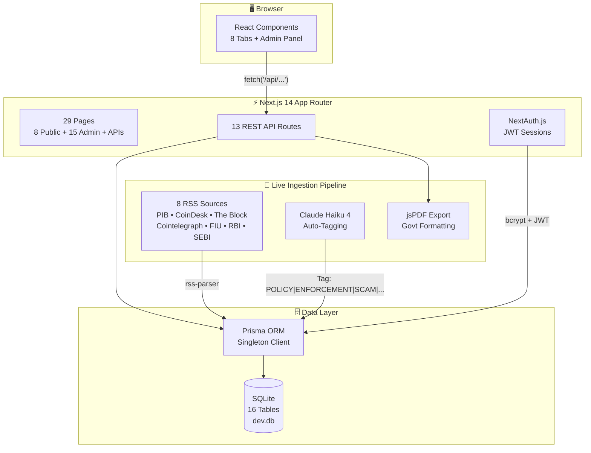
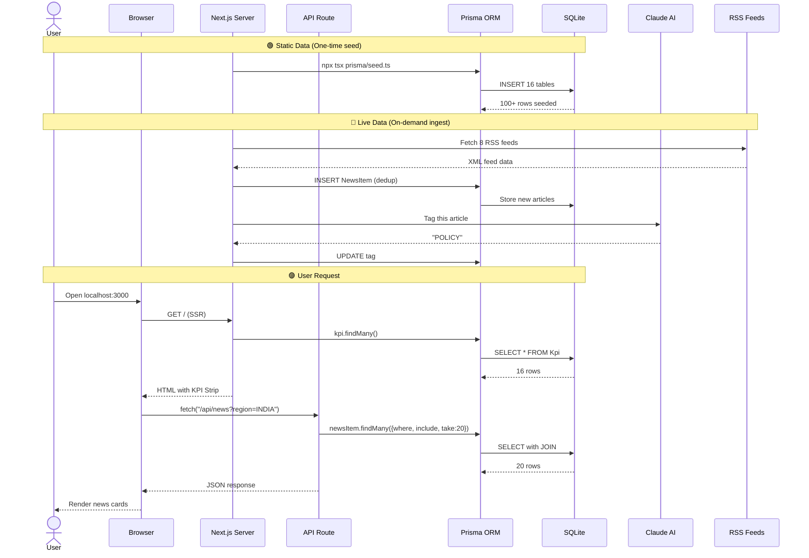
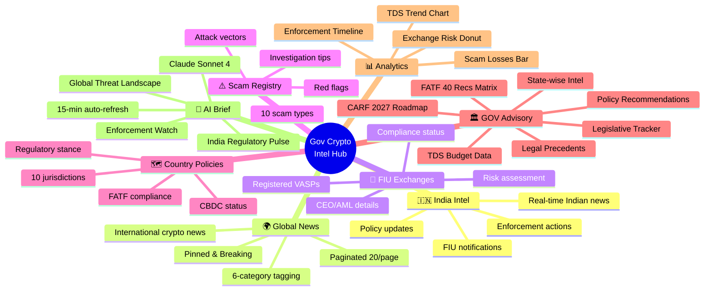
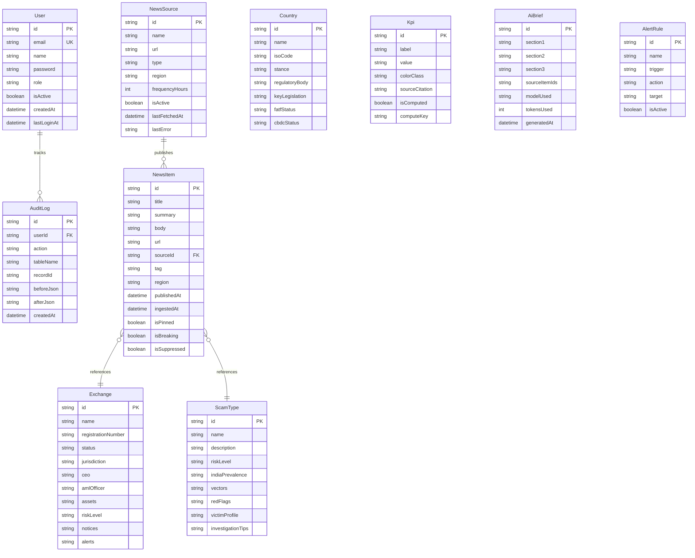
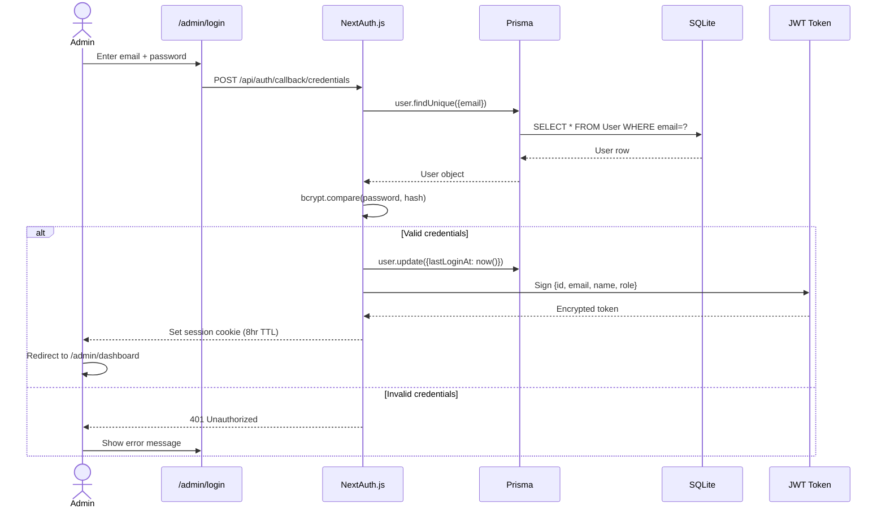
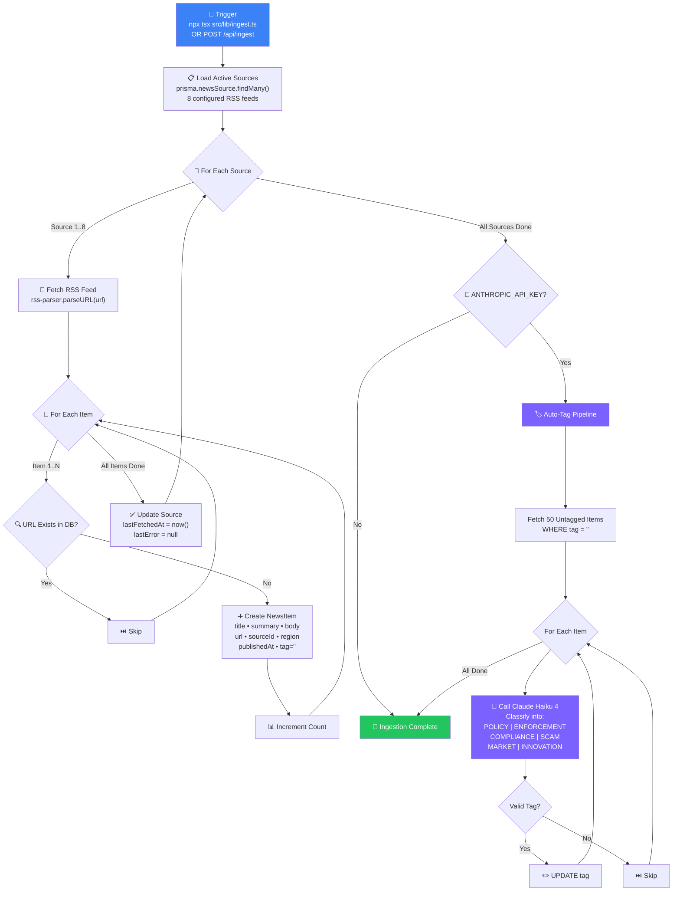
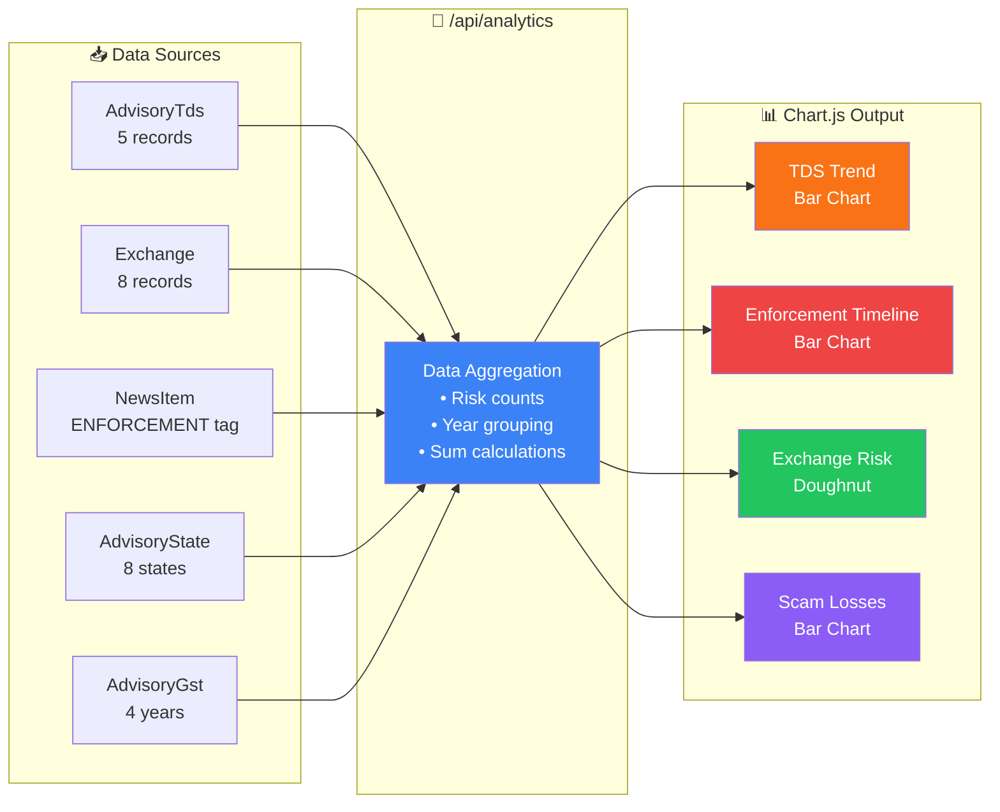
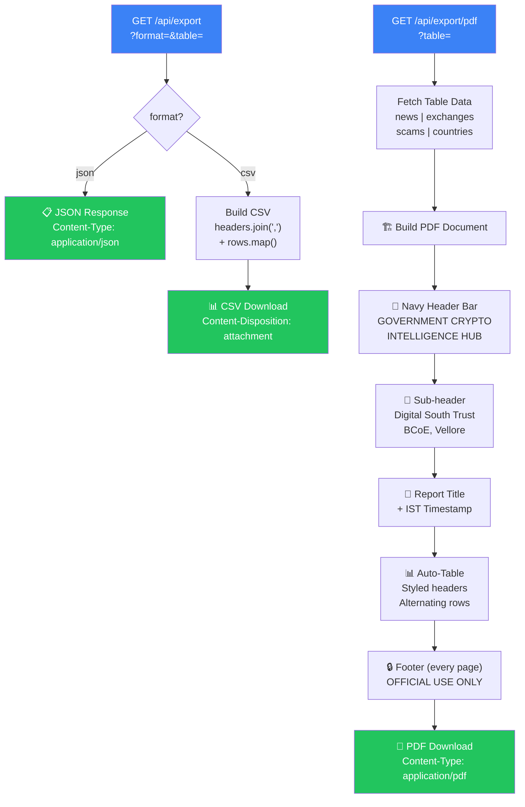

# 🛡️ Government Crypto Intelligence Hub

<p align="center">
  
  
  
  
  
  
  
  
  
</p>

<p align="center">
  <b>A comprehensive, real-time cryptocurrency intelligence dashboard for monitoring regulatory developments, scam patterns, FIU-registered exchanges, and policy frameworks — with a primary focus on India.</b>
</p>

<p align="center">
  <sub>Built for <b>Digital South Trust</b> • Blockchain Centre of Excellence, Vellore</sub>
</p>

---

## 🏗️ System Architecture



---

## 🔄 Data Flow



---

## 🎯 Feature Tabs



---

## 🗄️ Database Schema



---

## 🔐 Authentication Flow



---

## 📡 News Ingestion Pipeline



---

## 📊 Analytics Data Flow



---

## 📄 Export System



---

## 🛠️ Tech Stack

| Layer | Technology |
|-------|-----------|
| **Framework** | Next.js 14 (App Router) |
| **Language** | TypeScript 5 |
| **Styling** | Tailwind CSS 3 + Custom Navy Theme |
| **Charts** | Chart.js 4 + react-chartjs-2 |
| **Icons** | Lucide React |
| **ORM** | Prisma 5 |
| **Database** | SQLite (dev) / PostgreSQL (prod-ready) |
| **Auth** | NextAuth.js 4 (Credentials + JWT) |
| **AI Brief** | Claude Sonnet 4 |
| **Auto-Tag** | Claude Haiku 4 |
| **PDF Export** | jsPDF + jspdf-autotable |
| **RSS Ingest** | rss-parser |

---

## 📦 Quick Start

```bash
# 1. Clone & Install
git clone <repo-url>
cd gov-crypto-intel-hub
npm install

# 2. Initialize Database
npx prisma db push
npx tsx prisma/seed.ts

# 3. Start Development Server
npm run dev
# → http://localhost:3000
```

### Default Admin Credentials

| Field | Value |
|-------|-------|
| Email | `admin@govcryptointel.org` |
| Password | `admin123` |
| Role | SUPER_ADMIN |

> ⚠️ **Change the default password immediately in production.**

---

## 📋 NPM Scripts

| Command | Action |
|---------|--------|
| `npm run dev` | Start dev server on port 3000 |
| `npm run build` | Production build (29 pages, zero errors) |
| `npm start` | Start production server |
| `npm run db:push` | Push Prisma schema to database |
| `npm run db:seed` | Run seed script (100+ sourced records) |
| `npm run db:studio` | Open Prisma Studio GUI |
| `npm run ingest` | Run RSS ingestion + Claude auto-tag |

---

## 📊 Project Stats

| Metric | Value |
|--------|-------|
| Total Pages | **29** |
| API Endpoints | **13** |
| Database Tables | **16** |
| Seed Records | **100+** |
| Tab Components | **8** |
| Chart Visualizations | **4** |
| Admin Panel Pages | **15** |
| Build Errors | **0** |
| Placeholder Data | **0** |

---

## 📄 Documentation

- **[CHANGES.md](CHANGES.md)** — Complete PRD deviation log with reasons and migration paths
- **[docs/report.pdf](docs/report.pdf)** — 30-page comprehensive LaTeX technical report
- **[docs/report.tex](docs/report.tex)** — LaTeX source for the technical report

---

## 🔒 Classification

<p align="center">
  <b>OFFICIAL USE ONLY</b><br/>
  <sub>This repository contains sensitive government intelligence infrastructure code.<br/>
  Distribution restricted to authorized personnel only.</sub>
</p>

<p align="center">
  <sub>© 2026 Digital South Trust • Blockchain Centre of Excellence, Vellore</sub>
</p>